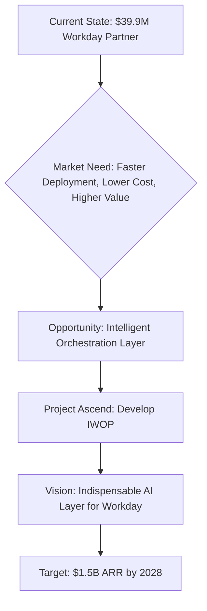
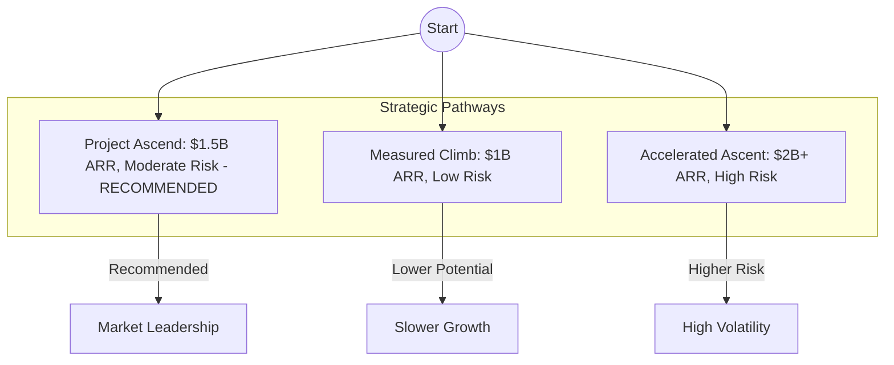
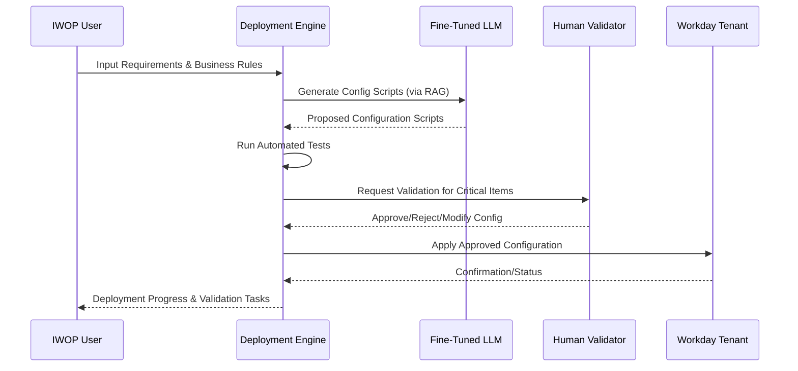
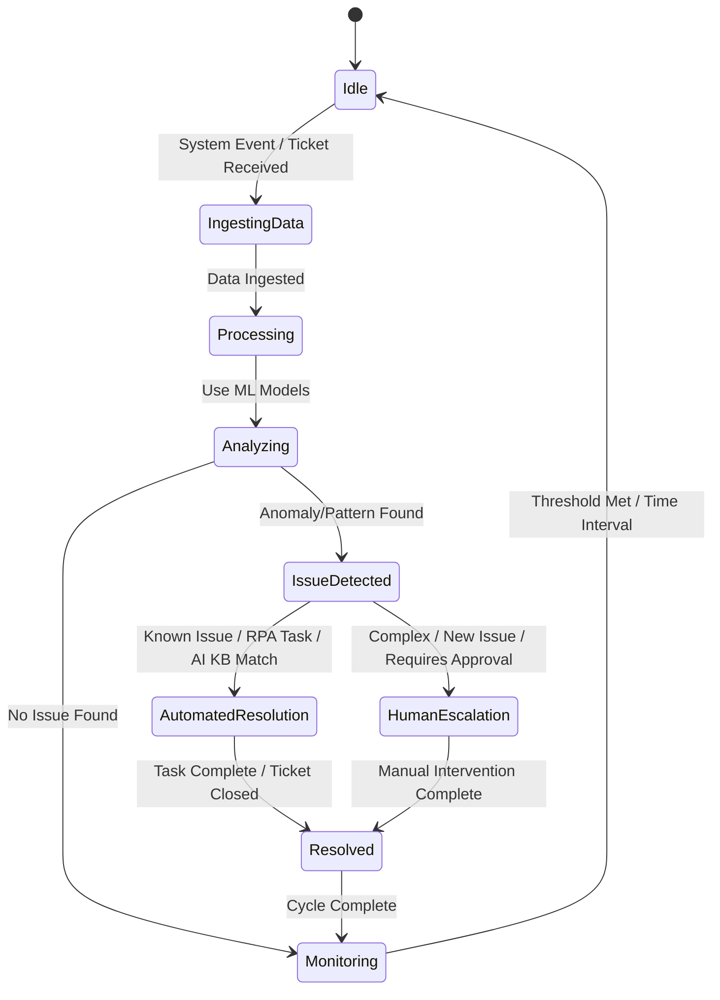
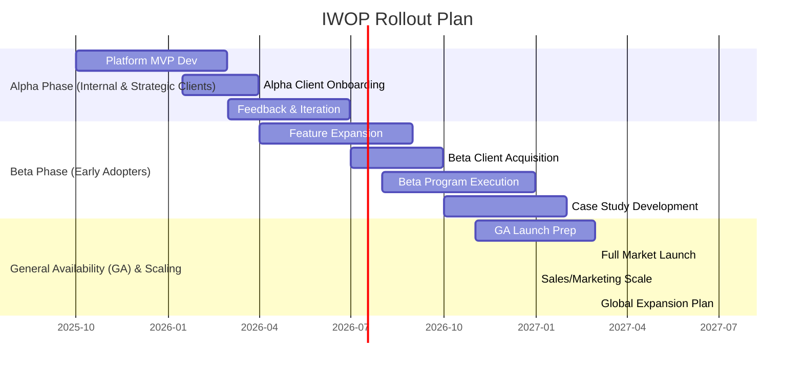
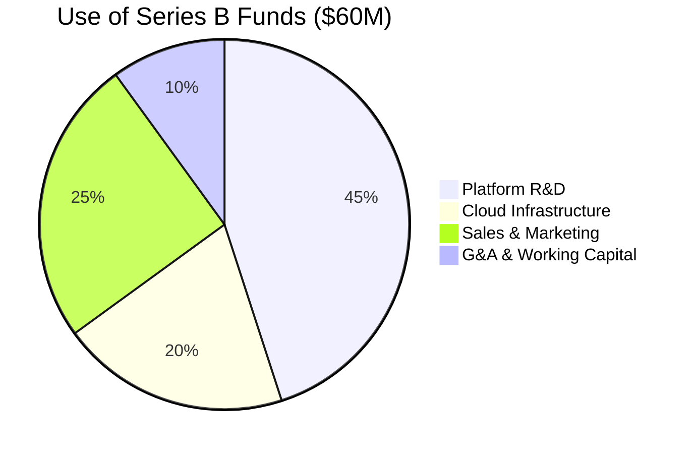

Okay, here is the comprehensive, professional strategic dossier for Project Ascend, integrating the provided information, enhancements, and Mermaid diagrams.

***

**Intecrowd Strategic Growth Dossier: Project Ascend**

**Version:** 2.0
**Date:** April 22, 2025
**Status:** Final Draft for Board Approval & Series B Funding

**[Document Confidentiality Notice]**

---

**Table of Contents**

1.  Executive Summary
2.  Introduction: The Imperative for Intelligent Orchestration
    2.1. Intecrowd: Current State & Foundation
    2.2. The Evolving Workday Ecosystem & Market Opportunity
    2.3. Vision & Mission: Leading the Intelligent Workday Era
3.  Market Analysis & Competitive Landscape
    3.1. Market Size & Growth Projections (Workday Services & Platforms)
    3.2. Target Client Segments & Personas
    3.3. Competitive Landscape Analysis
    3.4. Intecrowd's Differentiated Value Proposition: The IWOP Advantage
4.  Core Strategy: The Intelligent Workday Orchestration Platform (IWOP)
    4.1. Strategic Objectives
    4.2. IWOP: An Overview
    4.3. Core Pillars & Capabilities
    4.4. Strategic Pathways: Risk vs. Reward Analysis (Revised)
5.  Technical Architecture & Platform Deep Dive
    5.1. IWOP High-Level Architecture
    5.2. Module 1: AI-Accelerated Deployment & Configuration Engine
    5.3. Module 2: Intelligent Application Management Services (iAMS)
    5.4. Module 3: Unified Integration & Process Orchestration Hub
    5.5. Module 4: Predictive Analytics & Insights Engine
    5.6. Technology Stack & Rationale
    5.7. Security, Compliance & Governance Framework
    5.8. Scalability & Infrastructure Strategy (Multi-Cloud)
6.  Go-to-Market Strategy
    6.1. Phased Rollout Plan (Alpha, Beta, GA)
    6.2. Target Audience & Ideal Customer Profile (ICP) Refinement
    6.3. Branding & Positioning: "Intelligent Workday Orchestration"
    6.4. Sales Strategy: Land & Expand, Co-Selling, Value-Based Selling
    6.5. Marketing Strategy: Content, Digital, Events, Partnerships
    6.6. Pricing & Packaging Model (Tiered & Modular)
    6.7. Customer Journey & Success Framework
7.  Implementation Roadmap & Phased Execution (Inception to Market Leadership)
    7.1. Overall Program Timeline (2025-2028)
    7.2. Phase 1: Foundation & Alpha (Q4 2025 - Q2 2026)
    7.3. Phase 2: Beta Launch & Initial Scaling (Q3 2026 - Q2 2027)
    7.4. Phase 3: General Availability & Global Expansion (Q3 2027 - Q4 2028)
    7.5. Key Performance Indicators (KPIs) & Success Metrics
8.  Organizational Structure & Talent Strategy
    8.1. Evolving Organizational Design
    8.2. Key Roles & Responsibilities (New Functions)
    8.3. Talent Acquisition, Development & Retention Plan
    8.4. Culture of Innovation & Change Management
9.  Financial Projections & Funding Request
    9.1. Financial Model Assumptions (Driver-Based)
    9.2. ARR Projections & Revenue Breakdown (2025-2028)
    9.3. Gross Margin & Profitability Analysis
    9.4. Series B Funding Request: $60M
    9.5. Detailed Use of Funds Allocation
    9.6. Key Financial Metrics & Sensitivity Analysis
    9.7. Potential Exit Strategies
10. Risk Management & Mitigation Framework (Expanded)
    10.1. Detailed Risk Register (Technology, Market, Execution, Financial, Regulatory)
    10.2. Mitigation & Contingency Plans
11. Conclusion & Call to Action
12. Appendices (Optional: Market Research Data, Team Bios, Detailed Tech Specs)

---

### 1. Executive Summary

Intecrowd, currently a respected $39.9M Workday services partner, is poised for a transformative leap with Project Ascend. This strategic initiative will evolve Intecrowd from a boutique consultancy into the definitive leader in **Intelligent Workday Orchestration**, creating a projected **$1.5 Billion ARR** business by EOY 2028 with sustainable **>75% gross margins**. Project Ascend centers on the development and deployment of the Intelligent Workday Orchestration Platform (IWOP), an AI-powered SaaS solution designed to radically accelerate Workday deployment (<4 weeks), automate application management (80%+ Tier 1-2 automation), provide deep predictive insights, and seamlessly orchestrate processes across the Workday ecosystem and integrated enterprise applications. We recommend the **Project Ascend (Moderate Risk)** pathway, balancing aggressive innovation with disciplined, phased execution using stable, cutting-edge technologies. Securing a **$60M Series B** investment is critical to fuel R&D (45%), scale infrastructure (20%), and execute our go-to-market strategy (25%), positioning Intecrowd as the indispensable intelligence layer for the Workday ecosystem.

### 2. Introduction: The Imperative for Intelligent Orchestration

**2.1. Intecrowd: Current State & Foundation**
Intecrowd is an established Workday partner with $39.9M ARR, strong client relationships, deep Workday expertise, and a proven track record in Application Management Services (AMS) and deployment services. This provides a solid foundation and an initial customer base for IWOP.

**2.2. The Evolving Workday Ecosystem & Market Opportunity**
The Workday market continues rapid growth, but clients face significant challenges: lengthy implementations (6-9 months), high ongoing management costs, complex integrations, talent shortages, and difficulty extracting strategic value from their investment. There is a substantial unmet need for an intelligent layer that simplifies, automates, optimizes, and orchestrates the entire Workday lifecycle. Based on internal analysis and market indicators, the addressable market for intelligent orchestration solutions within the Workday ecosystem is estimated to exceed $10B annually by 2028.

**2.3. Vision & Mission**
* **Vision:** To be the indispensable intelligent orchestration layer for the global Workday ecosystem, empowering organizations to maximize the strategic value of their investment.
* **Mission:** To deliver the Intelligent Workday Orchestration Platform (IWOP), leveraging AI and automation to radically simplify Workday deployment, optimize ongoing management, provide predictive insights, and enable seamless integration, driving unprecedented efficiency and value for our clients.



### 3. Market Analysis & Competitive Landscape

*(Note: Market analysis is based on the information provided and standard industry knowledge within the Workday ecosystem.)*

**3.1. Market Size & Growth Projections**
The Total Addressable Market (TAM) encompasses Workday services, AI applications within HR/Finance Technology, and enterprise automation platforms. The Serviceable Addressable Market (SAM) focuses on organizations utilizing Workday seeking optimization and automation, while the Serviceable Obtainable Market (SOM) represents the segment Intecrowd can realistically capture with IWOP. We project significant growth in AI-driven automation within enterprise SaaS ecosystems, supporting the >$10B market opportunity for solutions like IWOP by 2028.

**3.2. Target Client Segments & Personas**
* **Initial Focus:** Existing Intecrowd AMS clients (Mid-Market & Enterprise). Leverage established relationships for early adoption.
* **Expansion:** New Workday customers (all segments), particularly large enterprises (> $5B revenue) seeking optimization, automation, and strategic value realization. Also target Mid-Market ($500M-$5B revenue) organizations struggling with Workday ROI or high management costs.
* **Key Personas:** CHRO, CFO, CIO, VP of IT, Workday Administrators, HR/Finance Process Owners, Digital Transformation Leads.

**3.3. Competitive Landscape Analysis**
* **Traditional Consultancies (Accenture, Deloitte, IBM, etc.):** Strengths in relationships and breadth of service. Weaknesses include slower, less productized approaches, higher costs for comparable outcomes, and less focus on AI-driven orchestration.
* **Niche Automation/Testing Tools:** Offer point solutions (e.g., testing, RPA for specific tasks) but lack IWOP's holistic deployment-to-management-to-integration orchestration capabilities.
* **Potential Platform Competitors:** Emerging startups or large SaaS vendors potentially adding overlapping features. Risk mitigated by IWOP's deep Workday specialization and speed to market.
* **Workday Itself:** Potential for "coopetition." Workday may develop native features addressing some pain points, but is unlikely to match IWOP's focus on cross-ecosystem orchestration (beyond Workday), deep third-party integration, and specialized AI models for deployment and AMS.

**3.4. Intecrowd's Differentiated Value Proposition: The IWOP Advantage**
* **Holistic Ecosystem Orchestration:** Uniquely manages deployment, AMS, integration, and predictive analytics within a single, AI-driven platform tailored for the Workday environment.
* **Deep Workday Specialization:** Built *by* Workday experts, *for* the Workday ecosystem, ensuring nuanced understanding and optimal configuration.
* **AI-Powered Proactivity & Optimization:** Moves beyond reactive support to predictive issue detection, automated resolution, and proactive optimization recommendations (e.g., compliance gaps, process bottlenecks).
* **Radical Speed & Efficiency:** Dramatically reduces implementation timelines (<4 weeks vs. 6-9 months) and slashes AMS costs (>80% Tier 1-2 automation).
* **Measurable ROI & Strategic Enablement:** Delivers clear, quantifiable value through cost savings, efficiency gains, enhanced compliance, improved user experience, and unlocking strategic insights from Workday data.

```mermaid
quadrantChart
    title Competitive Positioning
    x-axis "Focus: Holistic Orchestration" --> "Focus: Point Solutions"
    y-axis "AI/Automation Depth" --> "Manual/Traditional"
    quadrant 1 "High Orchestration / High AI"
    quadrant 2 "Low Orchestration / High AI"
    quadrant 3 "Low Orchestration / Low AI"
    quadrant 4 "High Orchestration / Low AI"
    "IWOP (Intecrowd)": [0.8, 0.9]
    "Large Consultancies": [0.3, 0.2]
    "Niche Automation Tools": [0.2, 0.7]
    "Emerging Platforms": [0.6, 0.6]
    "Workday Native (Potential)": [0.4, 0.5]
```

### 4. Core Strategy: The Intelligent Workday Orchestration Platform (IWOP)

**4.1. Strategic Objectives**
* Achieve **$1.5B ARR** by EOY 2028.
* Secure **>30% market share** of the target Workday intelligent orchestration segment.
* Maintain sustainable **>75% Gross Margins** post-2027.
* Establish IWOP as the **category-defining platform** for Workday ecosystem management.
* Achieve industry-leading **>95% customer satisfaction (CSAT/NPS)** and retention rates.

**4.2. IWOP: An Overview**
IWOP is a modular, AI-powered, multi-tenant SaaS platform architected to intelligently orchestrate the entire lifecycle of Workday and its connected enterprise systems. It transitions Intecrowd from a service provider to a high-margin SaaS business.

**4.3. Core Pillars & Capabilities**
* **AI-Accelerated Deployment & Configuration:** Leverages fine-tuned LLMs and automation to reduce Workday implementation timelines from months to under four weeks.
* **Intelligent AMS (iAMS):** Employs predictive analytics and RPA to automate >80% of Tier 1-2 support tasks, enabling proactive monitoring and predictive maintenance.
* **Unified Integration & Process Orchestration:** Provides pre-built connectors and a low-code interface to seamlessly connect Workday with other critical systems (e.g., Salesforce, SAP, Oracle, ServiceNow) and automate cross-application workflows.
* **Predictive Analytics & Insights:** Delivers actionable intelligence derived from Workday and integrated system data, focusing on strategic HR (talent retention risk, mobility), Finance (budget variance, forecasting), Operations (process efficiency), and Compliance.

**4.4. Strategic Pathways: Risk vs. Reward Analysis (Revised)**

| Path               | Risk Profile   | ARR Target (2028) | Key Differentiators                                         | Tech Approach                       | Recommendation Rationale                                                 |
| :----------------- | :------------- | :---------------- | :---------------------------------------------------------- | :---------------------------------- | :----------------------------------------------------------------------- |
| Measured Climb     | Low            | $800M–$1B         | Focus on core AMS/Deployment automation; slow integration   | Proven, stable tech; gradual AI     | Lower risk, but potentially misses market window; less competitive edge. |
| **Project Ascend** | **Moderate** | **$1.5B** | **Balanced AI innovation, full orchestration focus** | **Stable core + Cutting-edge AI** | **Optimal balance of ambition & execution; captures market leadership.** |
| Accelerated Ascent | High           | $2B+              | Aggressive AI features; rapid global expansion              | Bleeding-edge tech; high R&D burn   | Higher potential reward, but significant execution & technical risks.      |



### 5. Technical Architecture & Platform Deep Dive

**5.1. IWOP High-Level Architecture**
A multi-tenant SaaS platform built on a microservices architecture, deployed on leading cloud infrastructure (AWS/Azure), emphasizing API-first design principles.

```mermaid
graph LR
    subgraph "Cloud Infrastructure (AWS/Azure)"
        direction TB
        LB[Load Balancer] --> APIServer[API Gateway (Kong/Apigee)];
        APIServer --> Microservices;
        subgraph "IWOP Microservices"
            direction TB
            AuthN[Authentication]
            DeployEngine[AI Deployment Engine]
            iAMS[Intelligent AMS]
            IntegHub[Integration Hub]
            Analytics[Analytics Engine]
            CorePlatform[Platform Services]
        end
        Microservices --> DBs[Databases (Postgres/NoSQL)];
        Microservices --> Cache[Caching (Redis)];
        Microservices --> Queues[Message Queues (Kafka/SQS)];
        Analytics --> DW[Data Warehouse (Snowflake/Redshift)];
        DeployEngine --> LLMAPI[Fine-tuned LLM APIs (GPT/Claude)];
        iAMS --> MLModels[ML Models (XGBoost/LSTM/etc.)];
        iAMS --> RPA[RPA Engine (UiPath)];
        IntegHub --> Connectors[External System Connectors];
    end
    User[End User/Admin] --> WebApp[Web Application (React/Vue)];
    WebApp --> LB;
    APIClient[API Client/Partner] --> APIServer;
    Connectors <--> ExternalSystems[Salesforce, SAP, Oracle, etc.];
```

**5.2. Module 1: AI-Accelerated Deployment & Configuration Engine**
* Utilizes fine-tuned Large Language Models (LLMs like GPT/Claude variants), trained on extensive Workday documentation, best practices, and anonymized configuration data, to generate initial configuration scripts, business process definitions, and data migration mappings.
* Incorporates Retrieval-Augmented Generation (RAG) using Vector Databases for high context-specific accuracy.
* Features an automated testing suite to validate generated configurations against client requirements.
* Implements a human-in-the-loop (HITL) validation workflow via the IWOP interface for critical configuration steps and sign-offs.
* **Goal:** Reduce manual configuration effort by over 70%, dramatically shortening deployment cycles.



**5.3. Module 2: Intelligent Application Management Services (iAMS)**
* Continuously ingests Workday operational data: logs, performance metrics, audit trails, and support tickets.
* Applies Machine Learning models (e.g., XGBoost/SVM for ticket classification/routing, LSTM for time-series anomaly detection and performance prediction) to analyze the data streams.
* Proactively predicts potential issues like integration failures, performance degradation, or compliance deviations before they impact users.
* Automates Tier 1 and Tier 2 support ticket resolution (>80%) using AI-driven knowledge base searches, contextual understanding, and RPA (UiPath) integration for executing routine tasks (e.g., password resets, simple user config adjustments, data validation checks).
* Auto-generates dashboards and reports on system health, usage trends, security posture, and compliance adherence.
* **Goal:** Achieve >80% automation of Tier 1-2 support tasks, shift AMS from reactive to proactive, and significantly reduce operational overhead.



**5.4. Module 3: Unified Integration & Process Orchestration Hub**
* Offers a library of pre-built, configurable connectors for major enterprise systems (Salesforce, SAP S/4HANA, Oracle Fusion, ServiceNow, Microsoft Dynamics 365, etc.) and standard protocols (REST, SOAP, OData).
* Employs an API-first design managed via robust API Management platforms (e.g., Kong, Apigee) for enhanced security, rate limiting, monitoring, and developer portal access.
* Provides a low-code/no-code visual interface for business users and administrators to design, deploy, and manage cross-system workflows (e.g., Employee Onboarding: Workday Hire -> Azure AD Account Creation -> ServiceNow Equipment Request -> Salesforce User Setup).
* Includes real-time monitoring, logging, and sophisticated error handling/retry logic for integration flows.

**5.5. Module 4: Predictive Analytics & Insights Engine**
* Leverages data aggregated by the iAMS, Deployment Engine, Integration Hub, and direct Workday reporting APIs (respecting data privacy and segregation).
* Provides intuitive dashboards and configurable alerts focused on strategic KPIs related to:
    * **HR:** Attrition risk scoring, internal mobility predictions, compensation benchmark analysis, DE&I metrics.
    * **Finance:** Budget variance forecasting, cash flow prediction, expense compliance risk.
    * **Operations:** Business process efficiency bottlenecks, automation opportunities.
* Utilizes ML models for forecasting, trend analysis, and "what-if" scenario modeling.
* Offers optional, anonymized, aggregated benchmark data allowing clients to compare their performance against industry peers (Premium Add-on Feature).

**5.6. Technology Stack & Rationale**
* **Frontend:** React / Vue.js (Modern, component-based frameworks for rich, interactive user interfaces).
* **Backend Microservices:** Python (Strong AI/ML ecosystem), Go (High performance, concurrency), Node.js (Event-driven I/O). Selected per microservice needs.
* **AI/ML:** Python (Scikit-learn, TensorFlow/PyTorch), XGBoost, Leading LLM APIs (OpenAI/Anthropic - utilizing fine-tuned models), Vector Databases (e.g., Pinecone, Weaviate for RAG).
* **Databases:** PostgreSQL (Primary relational store), MongoDB/DynamoDB (Flexible NoSQL for specific services), Snowflake/Redshift/BigQuery (Cloud Data Warehouse for Analytics Engine).
* **Infrastructure:** AWS (Primary), Azure (Secondary/DR) - Leveraging managed services (Kubernetes - EKS/AKS, Serverless - Lambda/Functions, Managed DBs, etc.). Docker for containerization.
* **Integration & Messaging:** Kong/Apigee (API Management), Kafka/SQS/PubSub (Asynchronous communication, event streaming), UiPath (RPA).
* **Monitoring & Observability:** Datadog / New Relic / Dynatrace (Comprehensive APM, logging, tracing).

**5.7. Security, Compliance & Governance Framework**
* **Architecture:** Zero Trust principles implemented throughout.
* **Data Protection:** End-to-End Encryption (TLS 1.3+ for data in transit, AES-256 for data at rest). Robust key management. Data segregation between tenants.
* **Compliance Certifications:** Target SOC2 Type II, ISO 27001.
* **Regulatory Adherence:** Built-in features to aid GDPR/CCPA compliance (e.g., data mapping tools, support for Data Subject Access Requests - DSARs), automated checks.
* **Practices:** Regular third-party penetration testing, continuous vulnerability scanning, SAST/DAST in CI/CD pipelines, strict Role-Based Access Control (RBAC), comprehensive audit logging.

**5.8. Scalability & Infrastructure Strategy**
* **Cloud Foundation:** Multi-cloud strategy (AWS primary, Azure for DR/specific services) for resilience and flexibility.
* **Orchestration:** Kubernetes (EKS/AKS) for container management and scaling microservices.
* **Scalability Patterns:** Horizontal auto-scaling for stateless services, database read replicas and sharding strategies for data tier, utilization of global CDNs (CloudFront/Azure CDN) for frontend performance.
* **Serverless:** Employ serverless functions (Lambda/Azure Functions) for event-driven processing and specific backend tasks where appropriate.
* **Infrastructure as Code (IaC):** Terraform/Pulumi for automated, repeatable infrastructure provisioning and management.

### 6. Go-to-Market Strategy

**6.1. Phased Rollout Plan**
* **Alpha (Q1 2026):** Engage 5-10 strategic existing Intecrowd clients. Focus: High-touch feedback on iAMS & Deployment Engine MVP. Goal: Validate core value prop, gather deep usage data.
* **Beta (Q3 2026):** Expand to 25-50 clients (mix of existing/new, diverse segments). Focus: Introduce Integration Hub basics, refine pricing, build initial case studies, test scalability.
* **General Availability (GA) (Q1 2027):** Full market launch targeting defined ICPs. Focus: Scale Sales & Marketing efforts, launch full feature set including Analytics Engine, establish market presence.



**6.2. Target Audience & Ideal Customer Profile (ICP) Refinement**
Focus on Mid-market ($500M-$5B revenue) and Enterprise (>$5B revenue) companies heavily invested in Workday HCM & Financials. ICP characteristics include: organizations struggling with Workday ROI, facing high AMS costs or long support queues, undergoing complex implementations/integrations/mergers, or prioritizing digital transformation, automation, and data-driven decision-making in HR/Finance.

**6.3. Branding & Positioning**
* **Core Message:** "Intecrowd IWOP: Intelligent Orchestration for the Workday Ecosystem."
* **Keywords:** AI-Powered, Automation, Orchestration, Workday Optimization, Predictive Insights, Seamless Integration, Strategic Value, Efficiency.
* **Positioning:** The essential intelligence and automation layer that unlocks the full potential of a client's Workday investment.

**6.4. Sales Strategy**
* **Land & Expand:** Prioritize converting existing Intecrowd services clients to IWOP (starting with iAMS). Use initial success to upsell additional modules (Integration, Analytics).
* **Workday Co-Selling:** Achieve official Workday Certified Solution Partner status. Engage actively in joint GTM planning, lead sharing, co-marketing, and prominent presence at Workday Rising and other ecosystem events.
* **Direct Sales Team:** Build a dedicated, specialized IWOP sales team trained in value-based selling methodologies. Focus on quantifying ROI, building business cases, and delivering tailored solution demonstrations. Equip with ROI calculators and strong reference materials.
* **Channel Partners (Phase 3):** Explore strategic partnerships with complementary service providers, regional SIs, or technology partners to extend market reach.

**6.5. Marketing Strategy**
* **Content Marketing:** Develop thought leadership content (whitepapers, blogs, webinars) on AI in HR/Finance, Workday optimization best practices, and the value of orchestration. Create compelling case studies from Alpha/Beta clients.
* **Digital Marketing:** Implement targeted SEO/SEM campaigns focusing on keywords related to Workday challenges and IWOP solutions. Utilize LinkedIn and other relevant platforms for targeted advertising and Account-Based Marketing (ABM) campaigns directed at ICPs.
* **Events:** Maintain a strong presence at key industry events (Workday Rising, HR Technology Conference, Gartner Summits - IT/Finance/HR). Host targeted executive roundtables.
* **Partnerships:** Co-marketing initiatives with Workday and potentially other complementary technology partners.
* **Public Relations:** Announce major milestones (funding, GA launch, key client wins, major feature releases) to build brand awareness and credibility.

**6.6. Pricing & Packaging Model (Tiered & Modular)**
* **IWOP Essentials:**
    * Includes: Core iAMS automation (Tier 1 focus), Basic AI-Accelerated Deployment Tools.
    * Pricing: Per User/Month base fee + Tiered pricing based on the number/complexity of Workday modules managed.
* **IWOP Professional:**
    * Includes: Full iAMS capabilities (Tier 1 & 2 automation), Full Deployment Engine, Basic Integration Hub (limited connectors/workflows), Core Analytics Dashboards.
    * Pricing: Higher Per User/Month fee + Platform Fee.
* **IWOP Enterprise:**
    * Includes: All Professional features + Advanced Integration/Orchestration capabilities, Full Predictive Analytics Engine suite, Compliance Automation Modules, Premium Support SLAs, Access to Benchmarking Data (optional add-on).
    * Pricing: Custom pricing based on scope, volume, and specific module configuration.
* **Add-ons:** Offer specific premium analytics modules (e.g., Talent Mobility Forecaster, Predictive Compliance Engine), complex or custom integration connectors, dedicated technical account management.

**6.7. Customer Journey & Success Framework**
* **Onboarding:** Structured, efficient onboarding process leveraging IWOP's own deployment capabilities where applicable. Dedicated implementation support.
* **Customer Success Management (CSM):** Assign dedicated CSMs post-onboarding. Focus on driving adoption, identifying expansion opportunities, ensuring value realization, and building strong relationships.
* **Value Realization:** Regular Business Reviews (QBRs) focused on quantifying the achieved ROI (cost savings, efficiency gains, time saved) against initial business case.
* **Support:** Multi-channel support (portal, chat, phone) integrated with iAMS for proactive issue identification and faster resolution. Premium support tiers available.
* **Community:** Establish an online user community forum for knowledge sharing, best practices, and feedback.
* **Feedback Loop:** Systematically collect and incorporate customer feedback into the product roadmap via CSMs, surveys, and community channels.

```mermaid
flowchart TD
    A[Prospect Awareness (Marketing/Sales)] --> B{Qualification & Demo};
    B -- Qualifies --> C[Value Assessment & ROI Calculation];
    C --> D[Proposal & Contract Negotiation];
    D -- Signed --> E[Structured Onboarding & IWOP Setup];
    E --> F[Initial Value Realization (e.g., AMS Savings, Faster Deployment)];
    F --> G{Ongoing Usage & Proactive Support (CSM & iAMS)};
    G --> H[Regular Business Reviews (Value Tracking)];
    H -- Identify New Needs/Opps --> I[Upsell/Cross-sell Modules & Services];
    H -- Value Consistently Delivered --> J[Renewal & Advocacy/Referral];
    G -- Proactive Issue Alert (iAMS) --> K[Proactive Support Engagement];
    I --> G;
    J --> G;
    K --> G;
```

### 7. Implementation Roadmap & Phased Execution (Inception to Market Leadership)

**7.1. Overall Program Timeline (2025-2028)**
Execution will follow an Agile methodology, emphasizing iterative development, continuous feedback loops from early clients, and milestone-based progress tracking. Reference Gantt chart in Section 6.1 for visual timeline.

**7.2. Phase 1: Foundation & Alpha (Q4 2025 - Q2 2026)**
* **Focus:** Establish core platform, validate key AI capabilities, secure initial reference clients.
* **Key Deliverables:** Secure Series B Funding, Core Platform Architecture finalized, Security Framework implemented, MVP of AI Deployment Engine & iAMS delivered, Cloud Infrastructure (AWS) provisioned, Alpha Program Launched, Initial Feedback & Validation Report.
* **Key Activities:** Recruit core leadership (Platform Lead, AI Lead, Head of Eng), Scale initial Engineering pods, Set up DevSecOps practices, Define Alpha client success criteria, Intensive client feedback sessions.

**7.3. Phase 2: Beta Launch & Initial Scaling (Q3 2026 - Q2 2027)**
* **Focus:** Expand feature set, refine GTM strategy, build operational readiness for GA.
* **Key Deliverables:** Beta Version of IWOP (including basic Integration Hub & core Analytics Dashboards), Expanded library of integration connectors, Beta Program Report & initial Case Studies, GA Readiness Plan, Workday Certification achieved, Pricing model finalized.
* **Key Activities:** Scale Engineering, Product Management, and initial GTM (Sales, Marketing, CS) teams, Implement Beta client onboarding process, Develop sales enablement materials, Establish support infrastructure, Initiate multi-cloud setup (Azure DR).

**7.4. Phase 3: General Availability & Global Expansion (Q3 2027 - Q4 2028)**
* **Focus:** Achieve significant market penetration, establish market leadership, begin global expansion.
* **Key Deliverables:** IWOP GA Launch, Full Suite of Modules available, Scaled GTM operations driving predictable revenue growth, Internationalization strategy executed (Initial Markets: UK, Germany, France), Partner Program launched, Achieve $1.5B ARR Run Rate target by EOY 2028.
* **Key Activities:** Aggressive customer acquisition campaigns, Build out global infrastructure & support, Continuous feature enhancement based on market feedback, Establish strategic partnerships, Monitor competitive landscape, Explore potential M&A targets for acceleration.

**7.5. Key Performance Indicators (KPIs) & Success Metrics**
* **Platform & Financial:** ARR Growth Rate, Gross Margin %, Customer Acquisition Cost (CAC), LTV:CAC Ratio, Net Revenue Retention (NRR), Churn Rate (Logo & Revenue), Platform Uptime/Availability, Average Revenue Per Customer (ARPC).
* **Client Value & Adoption:** Measured Deployment Time Reduction (%), AMS Ticket Automation Rate (%), Quantified Client Cost Savings, Client Satisfaction (CSAT/NPS), Module Adoption Rate, Active Users.
* **Go-to-Market:** Sales Qualified Leads (SQLs), Lead-to-Opportunity Conversion Rate, Win Rate, Average Sales Cycle Length, Partner-Sourced Revenue.
* **R&D & Operations:** Feature Velocity/Release Cadence, Bug Resolution Time, AI Model Accuracy & Performance Drift, Security Incident Rate, Support Ticket Resolution Time (by tier).

### 8. Organizational Structure & Talent Strategy

**8.1. Evolving Organizational Design**
Transition from the current services-led structure to a product-led SaaS organization. Create dedicated, empowered teams for IWOP: Product Management, Engineering (Platform, AI/ML, SRE), Sales, Marketing, and Customer Success. Maintain a smaller, high-margin strategic Workday consulting arm focused on complex advisory services, potentially acting as a feeder for IWOP.

```mermaid
graph TD
    CEO --> CSO{Chief Strategy Officer (Oversees Ascend)};
    CEO --> CTO{CTO};
    CEO --> CRO{Chief Revenue Officer};
    CEO --> CPO{Chief Product Officer (IWOP)};
    CEO --> CFO{CFO};
    CEO --> CHRO{CHRO};
    CEO --> COO{COO (Strategic Services Arm)};

    CTO --> VP_Eng[VP Engineering (IWOP)];
    VP_Eng --> DevTeams[Platform Dev Teams];
    VP_Eng --> AI_ML[AI/ML Team];
    VP_Eng --> SRE_Infra[SRE/Infrastructure];
    VP_Eng --> Security;

    CRO --> VP_Sales[VP Sales (IWOP)];
    VP_Sales --> SalesTeams[Direct & Channel Sales];
    CRO --> VP_Mktg[VP Marketing (IWOP)];
    VP_Mktg --> MktgTeams[Demand Gen, Product Mktg];
    CRO --> VP_CS[VP Customer Success (IWOP)];
    VP_CS --> CSMs[Customer Success Managers];

    CPO --> ProdMgmt[Product Management Leads (IWOP Modules)];
    CPO --> UX_UI[UX/UI Design];

    COO --> ConsultLead[Consulting Services Lead];
```

**8.2. Key Roles & Responsibilities (New Functions Required)**
* **Technology:** Head of AI/ML, Lead Data Scientists, Platform Architects (Cloud, Microservices), Cloud Engineers (SRE), Security Engineers (DevSecOps).
* **Product:** Product Managers (aligned to IWOP Modules: Deployment, iAMS, Integration, Analytics), UX/UI Designers.
* **Go-to-Market:** SaaS Sales Executives (Enterprise & Mid-Market), Solution Consultants/Architects, Customer Success Managers, Product Marketing Managers, Demand Generation Specialists, Partner Manager.

**8.3. Talent Acquisition, Development & Retention Plan**
* **Acquisition:** Target experienced talent from successful SaaS, AI/ML, and enterprise software companies. Leverage strong employer branding focused on innovation, impact (transforming Workday ecosystem), and growth opportunity. Utilize specialized recruiters.
* **Compensation:** Offer competitive base salaries combined with significant equity participation (stock options) to align incentives with long-term value creation. Performance-based bonuses for GTM roles.
* **Work Environment:** Foster a remote-first or flexible hybrid work culture to attract talent globally. Invest in collaboration tools and practices.
* **Development:** Provide budgets and opportunities for continuous learning, particularly in AI/ML, cloud technologies, and Workday advancements. Establish clear career progression paths within the new SaaS structure.
* **Retention:** Cultivate a culture of innovation, ownership, and transparency. Implement strong management practices, regular feedback, recognition programs, and ensure work-life balance.

**8.4. Culture of Innovation & Change Management**
* **Communication:** Leadership must consistently communicate the Project Ascend vision, strategy, and progress transparently across the organization.
* **Collaboration:** Foster cross-functional collaboration between Product, Engineering, GTM, and Services teams. Break down silos.
* **Empowerment:** Empower teams with clear goals, autonomy to execute, and psychological safety to experiment and learn from failures.
* **Recognition:** Celebrate key milestones, successful releases, client wins, and innovative contributions.
* **Managing Transition:** Acknowledge the shift from a services model. Provide support and retraining opportunities for existing staff where appropriate. Address concerns proactively and demonstrate the benefits of the new strategy for both the company and individual career growth.

### 9. Financial Projections & Funding Request

**9.1. Financial Model Assumptions**
*(High-level - Detailed model in Appendix)* Key drivers include: Phased client acquisition based on GTM plan, tiered ARPU growth as clients adopt more modules, target NRR >120% driven by upsell/expansion, churn rate <5% annually post-GA, COGS primarily driven by cloud hosting costs and support staff (~20-25% of revenue at scale), significant upfront R&D investment tapering as % of revenue post-GA, efficient S&M spend (LTV:CAC ratio > 4:1 target).

**9.2. ARR Projections & Revenue Breakdown (2025-2028)**
* **2025 (Post-Series B): $65M** (Primarily existing services revenue + initial IWOP setup/pilot fees)
* **2026 (Beta Expansion): $150M** (IWOP Beta subscription revenue ramps significantly, services revenue stable/slight decline)
* **2027 (GA Scale): $500M** (Strong IWOP SaaS adoption post-GA, increasing ARPU from module expansion)
* **2028 (Market Leadership): $1.5B** (Approaching target market share, full module suite contributing, potential international revenue starts)
    *(Revenue Breakdown: Target ~70% Subscription, ~20% Premium AMS Tiers, ~10% Analytics/Add-ons by 2028)*

**9.3. Gross Margin & Profitability Analysis**
Target **Gross Margin >75%** by 2027 as the SaaS model scales and economies of scale in hosting and support are realized. Expect negative EBITDA through the high-growth investment phase (2025-2027), reaching EBITDA breakeven/profitability projected in late 2028 or early 2029 as revenue scale outpaces operating expense growth.

**9.4. Series B Funding Request: $60 Million**

**9.5. Detailed Use of Funds Allocation**
* **45% ($27M) Platform R&D:** Aggressively scale Engineering & AI/ML teams, accelerate development of Integration Hub & Predictive Analytics Engine, fund ongoing AI model training, tuning, and infrastructure.
* **20% ($12M) Cloud Infrastructure:** Build out robust, scalable, secure, multi-cloud (AWS/Azure) production environment capable of handling GA scale.
* **25% ($15M) Sales & Marketing:** Establish dedicated IWOP GTM leadership and teams (Sales, Marketing, CS), fund branding initiatives, demand generation campaigns, content creation, and Workday partnership activities.
* **10% ($6M) G&A & Working Capital:** Support scaling of operational functions (Finance, HR, Legal) and provide an operational buffer.



**9.6. Key Financial Metrics & Sensitivity Analysis**
Monitor ARR Growth, NRR, Gross Margin, LTV:CAC, Burn Rate, Cash Runway. Sensitivity analysis performed on key assumptions (e.g., client acquisition rate, churn, ARPU) to understand potential variations in outcomes. (Details in Appendix).

**9.7. Potential Exit Strategies**
While focused on building a sustainable, high-growth independent company, potential future exit strategies include:
* **IPO:** Path to public markets once scale, predictability, and profitability metrics are achieved (likely post-2028).
* **Strategic Acquisition:** Acquisition by a larger enterprise software vendor (e.g., major Cloud provider, larger SaaS player in adjacent space, potentially Workday itself) seeking entry/dominance in the Workday ecosystem optimization space.
* **Private Equity:** Acquisition by a PE firm focused on high-growth SaaS businesses.

### 10. Risk Management & Mitigation Framework (Expanded)

**10.1. Detailed Risk Register**

| Risk Category     | Specific Risk                                     | Likelihood | Impact | Mitigation Strategy                                                                                                | Contingency Plan                                                                  |
| :---------------- | :------------------------------------------------ | :--------- | :----- | :----------------------------------------------------------------------------------------------------------------- | :-------------------------------------------------------------------------------- |
| **Technology** | AI Model Performance/Accuracy Drift               | Medium     | High   | Continuous monitoring, automated retraining pipelines, HITL validation layers, diverse model testing, RAG accuracy checks. | Rollback to previous stable model version; Increase human oversight temporarily.    |
|                   | Scalability limitations under high load           | Medium     | High   | Robust cloud architecture (Kubernetes, auto-scaling), load testing, performance monitoring, multi-cloud design.        | Provision additional resources; Optimize critical code paths; Regional failover. |
|                   | Security Breach / Data Privacy Incident           | Low        | Severe | Zero Trust Architecture, Encryption, SOC2/ISO compliance, Pen Testing, Vulnerability Management, Employee Training.     | Incident Response Plan activated; Engage cybersecurity experts; Transparent comms. |
| **Market** | Slow Client Adoption / Resistance to Change       | Medium     | High   | Phased rollout (Alpha/Beta), Strong ROI messaging, Value-based selling, Free pilot programs, CSM focus on adoption.  | Refine pricing/packaging; Increase marketing spend; Pivot feature focus.        |
|                   | Increased Competition (Workday native or new entrants) | Medium     | High   | Deep Workday specialization, Rapid innovation pace, Strong partner ecosystem (esp. Workday), Focus on orchestration. | Acquire complementary tech; Double-down on differentiation (e.g., AI insights). |
|                   | Workday API Changes / Partnership Strain          | Low        | Medium | Active participation in Workday partner programs, Proactive API monitoring, Diversified integration methods.         | Adapt platform quickly; Leverage alternative data sources if possible.          |
| **Execution** | Failure to Attract/Retain Key Talent (AI/SaaS)  | Medium     | High   | Competitive Compensation (incl. Equity), Strong Culture, Remote/Hybrid Flexibility, Training & Development.         | Utilize specialized recruiters; Offer targeted retention bonuses; Interim hires.   |
|                   | Delays in Product Development / Roadmap Slippage  | Medium     | Medium | Agile methodology, Realistic planning, Cross-functional teams, Dependency tracking, Experienced leadership.        | Re-prioritize features; Allocate additional resources; Adjust GTM timeline.       |
|                   | Ineffective Go-to-Market Execution              | Medium     | High   | Experienced GTM leadership hires, Clear ICP definition, Value-based sales training, Pilot programs, Data-driven marketing. | Revise messaging/positioning; Adjust sales territories/quotas; Pivot channels.  |
| **Financial** | Higher Burn Rate / Shorter Runway than projected   | Medium     | High   | Detailed financial modeling, Milestone-based spending controls, Regular budget reviews, Focus on unit economics.    | Reduce discretionary spending; Seek bridge financing; Adjust hiring pace.       |
|                   | Failure to achieve ARR/Growth Targets           | Medium     | High   | Close monitoring of GTM KPIs, Agile GTM strategy adjustments, Strong CSM focus on NRR.                                | Downsize GTM investment; Focus on profitability; Explore strategic alternatives. |
| **Regulatory** | Changes in Data Privacy Laws (GDPR, CCPA, etc.) | Low        | Medium | Embedded compliance engine, Dedicated legal/compliance resources, Continuous monitoring of regulations.            | Update platform features & policies promptly; Notify clients.                   |

**10.2. Mitigation & Contingency Plans**
As outlined in the table above, proactive mitigation strategies are embedded in the plan. Contingency plans provide fallback options should specific risks materialize. Continuous risk monitoring and adaptation will be key.

### 11. Conclusion & Call to Action

Project Ascend represents a pivotal strategic evolution for Intecrowd, transitioning the company from a successful Workday services partner to the **category-defining leader in Intelligent Workday Orchestration**. The IWOP platform addresses critical, unmet needs within the rapidly growing Workday ecosystem, offering unparalleled value through AI-driven deployment acceleration, automated application management, seamless integration, and predictive insights.

The **$1.5B ARR target by 2028**, supported by a robust technical architecture, a clear phased GTM strategy, and a strong financial plan, is ambitious yet achievable under the recommended "Project Ascend" pathway. This pathway balances calculated risks in technological innovation with disciplined execution and a focus on delivering measurable client ROI.

Securing the **$60M Series B funding** is the crucial next step to power this transformation. These funds will directly fuel the R&D, infrastructure, and GTM investments necessary to build, launch, and scale IWOP effectively, capturing the significant market opportunity ahead.

**Recommended Next Steps:**
1.  **Board Approval:** Secure Board approval for Project Ascend and the associated strategy.
2.  **Approve Series B Funding:** Formally approve the $60M Series B funding request based on the detailed plan and use of funds.
3.  **Finalize Cloud Partnerships:** Execute final agreements with AWS and Azure to support the scalable, multi-cloud infrastructure plan.
4.  **Initiate Key Hires:** Immediately begin recruitment process for critical leadership roles (Platform Lead, AI Lead, Head of Eng/Product/GTM).
5.  **Launch Alpha Program Prep:** Commence detailed planning and client selection for the IWOP Alpha program targeted for Q1 2026 launch.

Project Ascend positions Intecrowd not just for substantial growth, but to become the indispensable AI layer shaping the future of the Workday ecosystem. We are confident in our strategy, our team, and our ability to execute this vision.

---

*Prepared by: Office of the Chief Strategy Officer, Intecrowd*
*Date: April 22, 2025*

***

### 12. Appendices

*(Placeholder: Could include detailed market research data, competitor feature comparisons, full team biographies, detailed technical specifications, detailed financial model.)*
